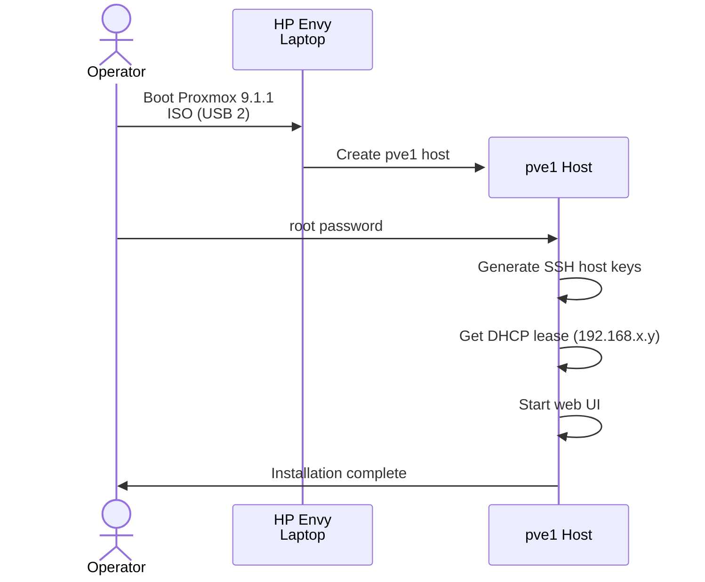
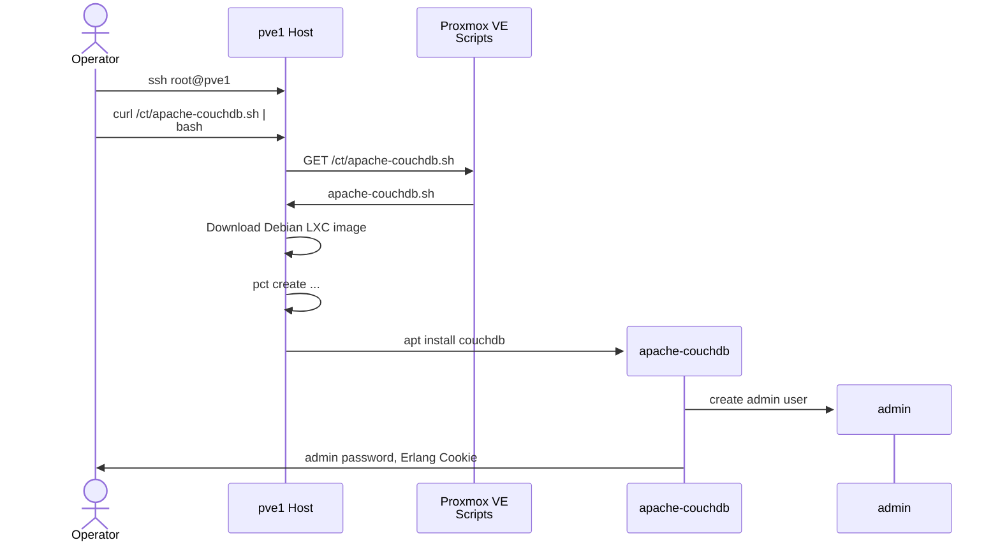
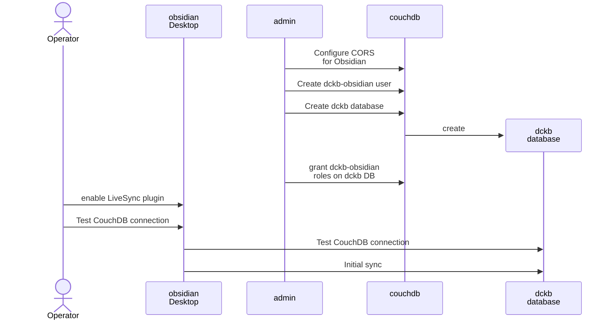
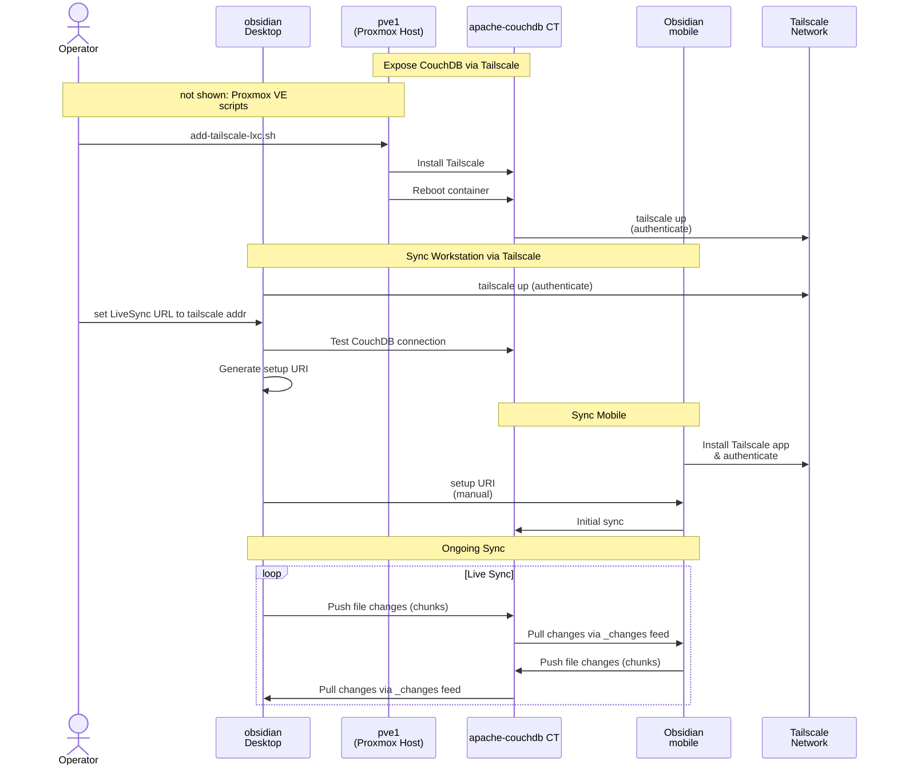

Self-hosted [Obsidian LiveSync](https://github.com/vrtmrz/obsidian-livesync) using CouchDB on Proxmox LXC container, secured with Tailscale VPN and end-to-end encryption.

## Proxmox VM / Container Host

I have [Proxmox VE 9.1](https://www.proxmox.com/en/downloads) running on an old (circa 2013) laptop. It has USB 3 ports, but only USB 2 seems to work for booting from a thumb drive.
SHA256SUM: `6d8f5afc78c0c66812d7272cde7c8b98be7eb54401ceb045400db05eb5ae6d22`

## apache-couchdb container

After flailing around trying to figure out CouchDB, I re-discovered [Proxmox VE Scripts](https://community-scripts.org/), especially [apache-couchdb](https://community-scripts.org/scripts/apache-couchdb).

## Sync from workstation to CouchDB

[obsidian-livesync](https://github.com/vrtmrz/obsidian-livesync) has a nifty
"everything in 1 URL" setup mechanism, but I only found docs for doing it on fly.io.

More flailing: after I installed the plugin, I couldn't find the [setup wizard](https://github.com/vrtmrz/obsidian-livesync/blob/main/docs/quick_setup.md). It turns out: I neglected to turn it on.

Then I puzzled over which usernames and passwords are for what. Eventually, I passed the wizard's connection test, and all was well.

## Mobile Sync

To expose CouchDB for mobile use, I used the [Proxmox Tailscale add-on](https://community-scripts.org/scripts/add-tailscale-lxc), since I've used **tailscale** before. _Maybe I'll find a more open alternative in due course, but that's for another day._

I tweaked the CouchDB host in Obsidian on my workstation to the tailscale `100.x.y.z` address, and then I let it generate a handy setup URI.

---

*Originally appeared as [a comment on obsidian + livesync for personal notes](https://github.com/dckc/madmode-blog/issues/237#issuecomment-4228178391).*
